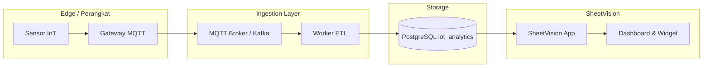

# Arsitektur Ingestion Data IoT → SheetVision

Dokumen ini menjelaskan pola integrasi data IoT **real-time / near-real-time** ke platform BI SheetVision. PoC saat ini memakai database PostgreSQL demo (`iot_analytics`) dengan data seed — bukan streaming langsung dari perangkat.

## Status PoC vs produksi

| Komponen | PoC (sekarang) | Produksi (rencana) |
|----------|----------------|---------------------|
| Sumber data IoT | Tabel `devices`, `sensor_readings` di Postgres | Gateway / message broker → Postgres |
| Frekuensi | Batch seed / polling manual | MQTT/Kafka → worker → DB (1–60 detik) |
| SheetVision | Baca DB via koneksi PostgreSQL | Sama + auto-refresh dashboard |
| Alerting | Tabel `device_alerts` statis | Rule engine / Grafana alerting (opsional) |

## Arsitektur referensi



## Komponen yang direkomendasikan

### 1. Edge & gateway
- Sensor mengirim payload JSON (suhu, kelembapan, energi, dll.)
- Gateway (ESP32, Raspberry Pi, atau vendor IoT) publish ke broker MQTT

### 2. Message broker
- **Mosquitto**, **EMQX**, atau **Kafka** untuk buffer & skalabilitas
- Topik contoh: `plant/zone-a/temperature`

### 3. Worker ingestion
- Service ringan (Node.js/Python) subscribe topik → validasi → tulis ke Postgres
- Skema target: `sensor_readings (device_id, metric, value, unit, recorded_at)`
- Idempotensi: deduplikasi berdasarkan `(device_id, recorded_at, metric)`

### 4. PostgreSQL analytics
- Database terpisah dari DB aplikasi SheetVision (sudah ada: `analytics-db` di Docker Compose)
- Role read-only `iot_reader` untuk koneksi dashboard

### 5. SheetVision
- Project PostgreSQL → host `analytics-db:5432` (di server Docker)
- Tabel: `sensor_readings`, `device_daily_summary`, `devices`, `device_alerts`
- Auto-refresh 5/15/30 menit untuk near-real-time

## Contoh payload & insert

```json
{
  "device_code": "TEMP-01",
  "metric": "temperature",
  "value": 28.4,
  "unit": "celsius",
  "recorded_at": "2026-06-25T10:00:00Z"
}
```

Worker memetakan `device_code` → `device_id`, lalu `INSERT INTO sensor_readings (...)`.

## Grafana / Metabase (opsional)

Strategi hybrid (lihat `docs/BRD_Platform_BI_dan_Data_Analytics.md`):

- **SheetVision** — self-service dashboard bisnis, formula kustom, NL query
- **Grafana** — monitoring operasional time-series & alerting teknis (embed iframe fase berikutnya)
- **Metabase** — eksplorasi SQL ad-hoc untuk analis data

Keduanya bisa membaca **PostgreSQL yang sama** (`iot_analytics`) tanpa duplikasi data.

## Langkah implementasi berikutnya

1. Deploy MQTT broker + worker sederhana di sisi server
2. Endpoint atau cron untuk agregasi harian → `device_daily_summary`
3. Dokumentasi topik & skema payload untuk tim hardware
4. (Opsional) Webhook dari gateway langsung ke API SheetVision untuk event-driven refresh

## Perintah terkait (PoC)

```bash
# Seed data IoT demo
docker compose exec app sh -c 'ANALYTICS_DB_HOST=analytics-db ANALYTICS_DB_PORT=5432 node scripts/seed-analytics-iot.mjs'
```
